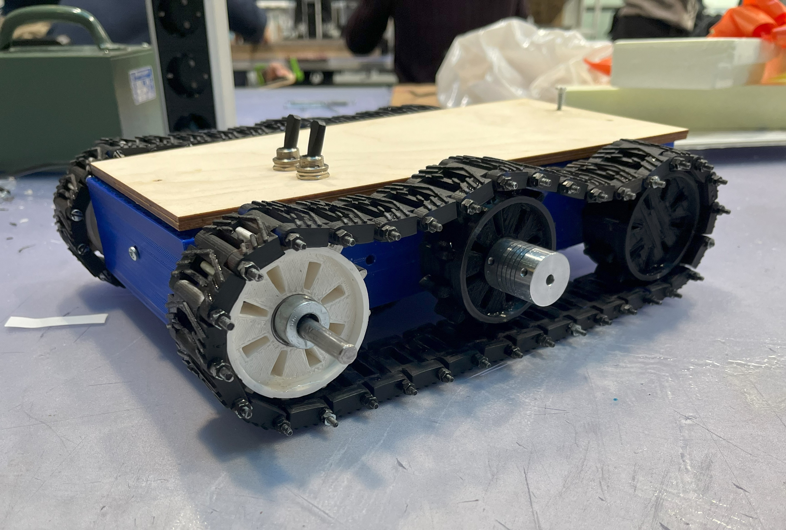
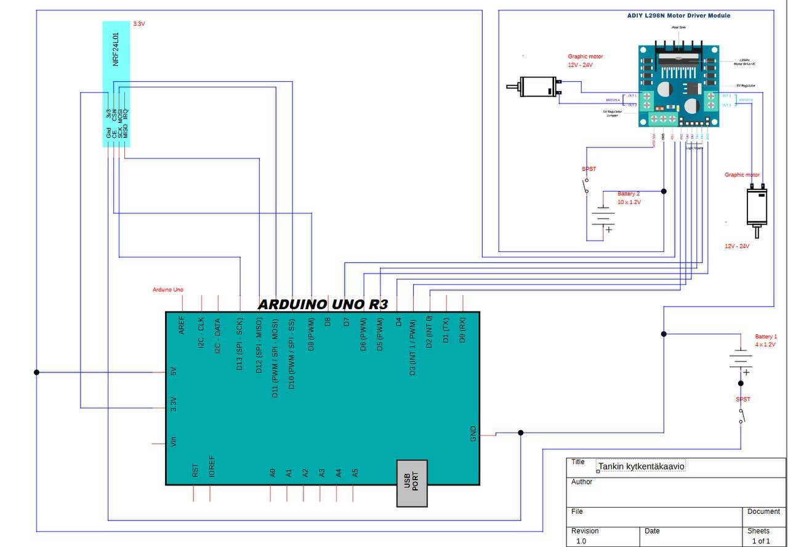
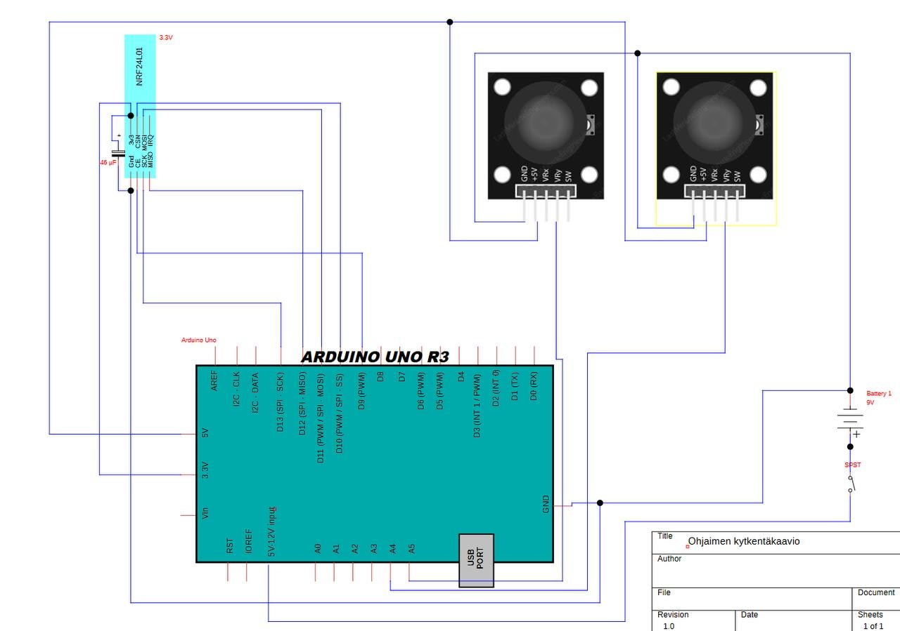
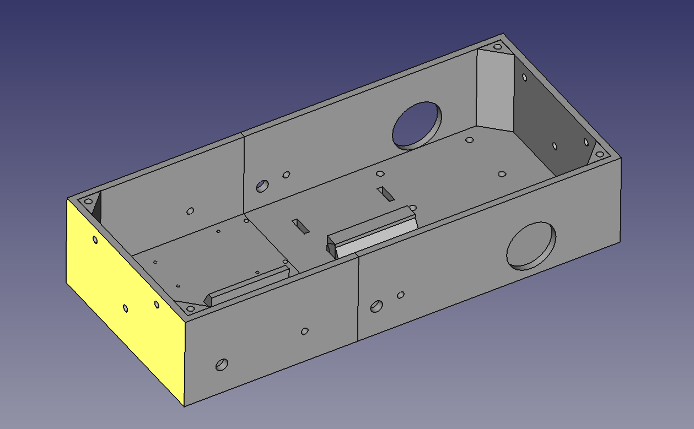
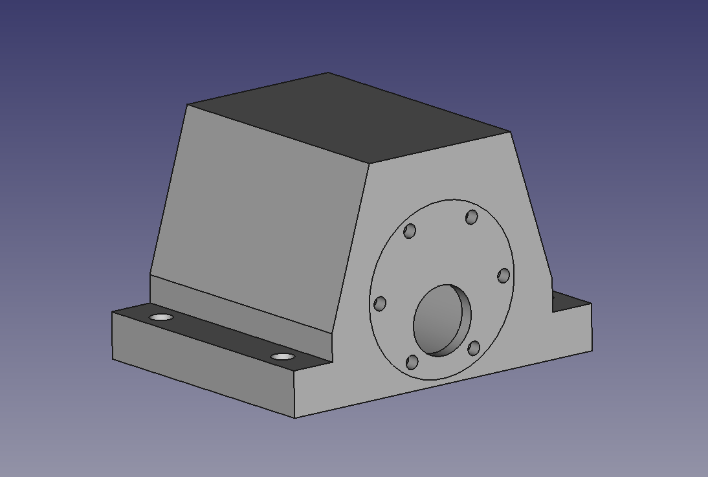
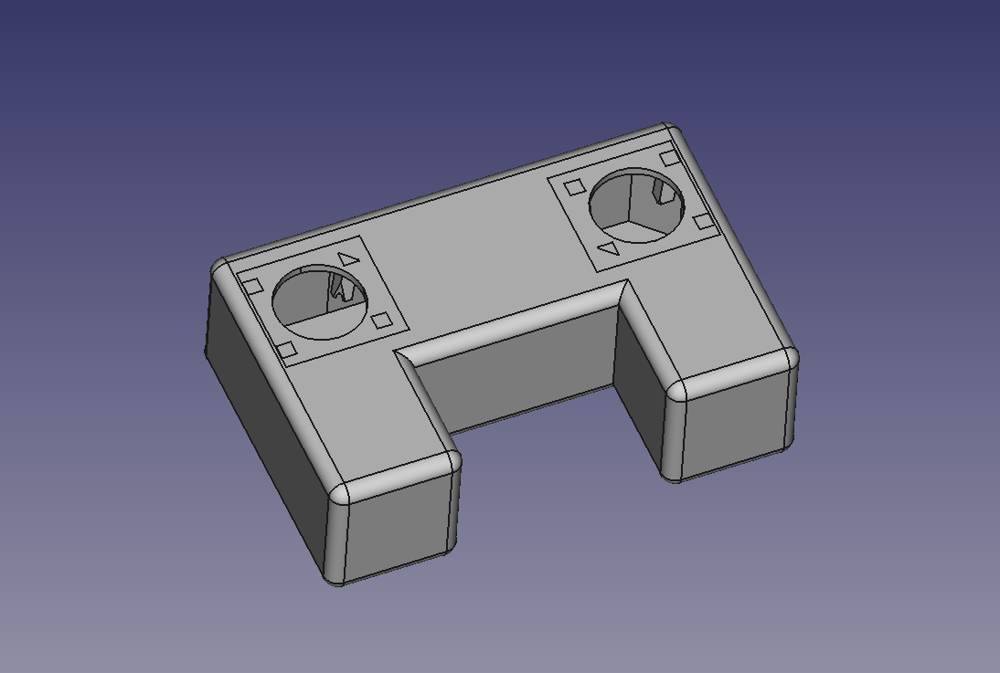
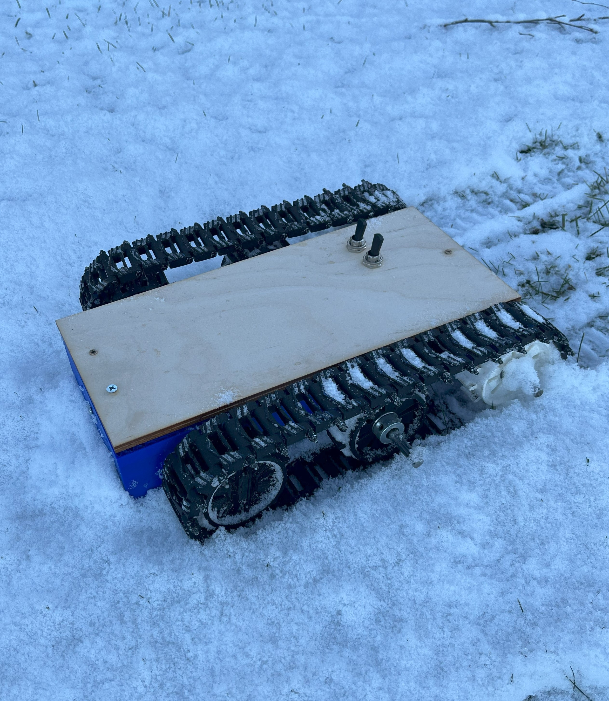

# Tele-Operated Robotics Platform
This repo outlines the documentation for a tele-operated threaded mini-tank robot system. The robot is controlled with a radio-controller, that sends it's signals to the tank. This will interpret the signals and run it's two DC motors with required PWM signals.
This repo documents the implementation of a treaded robot platform controlled with a RC link. The system interprets RC inputs to generate appropiate PWM signals for it's two DC motors, enabling tank-style steering and locomotion.

## Electronics
Parts List:
- Arduino
- L298N Dual-Motor Driver
- 12V DC Motors
- 3S Lipo
- Joysticks
- nRF24L01 transceivers

The wiring diagrams showcase both the robot and controller side. On the controller inputs from two joysticks are read and sent over on the nRF24L01 radio transceivers. The same module will receive it on the robot and respond accordingly.

## Code
The tank's receiver code has 3 functions per motor to either go forward, back or stop. A additional PWM signal is also sent to the motor driver to control the speed of movement. A robust connection reboot system has been developed; the robot will automatically reconnect the RC Link in case it notices a disconnection. This happens within a couple hundred ms and is not noticeable by the user as it does not immediately stop the current instruction set.
The controller's code is very simple, just sending over the analog data from the joystick's potentiometers in a value range of [0, 1023].
## CAD
The frame of the tank is CAD Designed and 3D-printed. The motors have their own mounts to secure them tightly to the frame. The shaft of the motors is brought as down as possible to give us maximal ground clearance. 

We also included a CAD design for the radio controller with two joysticks.

## Field Testing
The Robot was tested outside in rougher terrain, plowing through snow. The motors do offer enough torque to keep it moving, but more would be preferred. There is an issue with snow packing up on the threads making it harder to spin and enabling them to fall off. This likely wouldn't be an issue without snow. 

